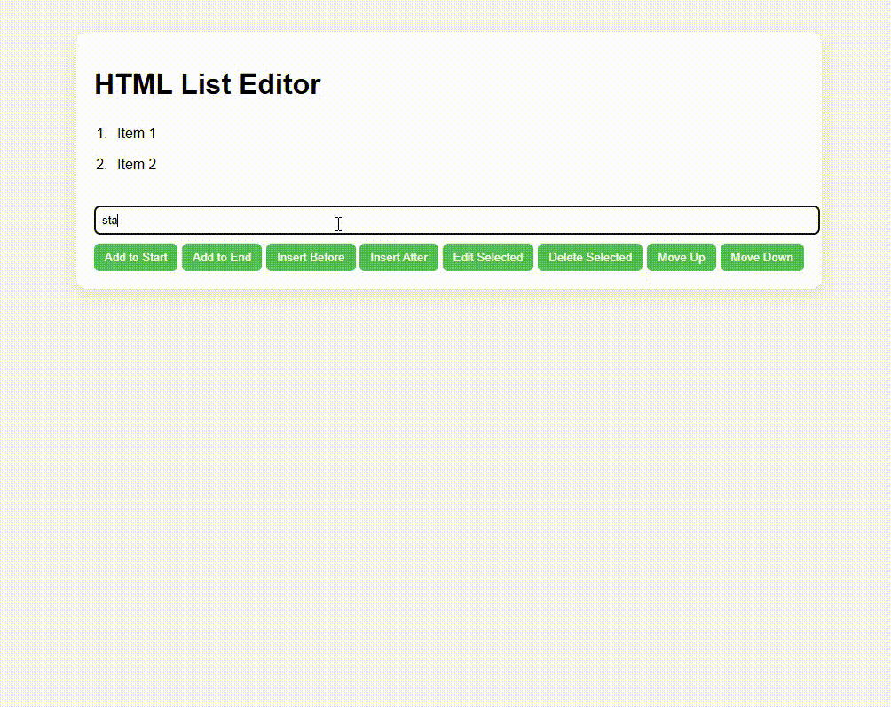

# 🧪 Add & Change HTML List (UL/LI DOM Manipulation)

This project demonstrates full interactive control over a `<ul>` HTML list using vanilla JavaScript.  
It supports adding, editing, deleting, inserting, moving items, and live HTML DOM preview.

---

## 🚀 Features

| Feature                    | Description                                  |
|----------------------------|----------------------------------------------|
| ➕ Add to Start/End        | Add a new `<li>` to the beginning or end     |
| 🧩 Insert Before/After     | Insert a new `<li>` relative to selected item|
| ✏️ Edit Selected           | Change content of selected `<li>`            |
| ❌ Delete Selected         | Remove a selected `<li>`                     |
| 🔼🔽 Move Up / Down        | Reorder selected `<li>` within the list      |


---

## 📸 Demo GIF

Below is a full demo of all functions working together:



*(This GIF shows adding, selecting, inserting, editing, moving, deleting, and viewing HTML preview)*

---

## 🧠 How to Use

1. **Click** on any item in the list to select it.
2. Type content in the text box.
3. Use the buttons:
   - `Add to Start` / `Add to End`
   - `Insert Before` / `Insert After`
   - `Edit`, `Delete`, `Move Up`, `Move Down`

---

## 🛠 Technologies

- HTML5
- CSS3
- JavaScript (Vanilla)

---

## 📂 Project Structure

```

add-change-html/
├── index.html       # Main HTML file
├── style.css        # Styling
├── script.js        # JavaScript logic
├── demo/
│   └── demo.gif     # Demo animation showing all features
└── README.md        # This documentation

```

---

## 📌 Notes

- No frameworks or libraries used
- Fully responsive and standalone
- Can be extended with `localStorage` or animations (e.g. drag & drop)

---