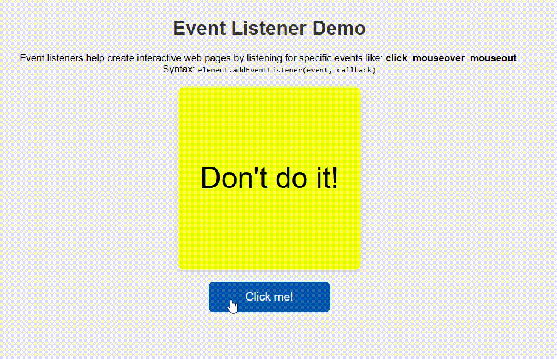

# Event Listener Demo

This project demonstrates how to use `addEventListener` in JavaScript to create interactive UI elements.

## Features

- Changes text and color on:
  - Click
  - Mouse over
  - Mouse out

## How to Run

1. Clone or download the project.
2. Open `index.html` in a browser.

## File Structure

- `index.html` - Main HTML file
- `style.css` - Styles for layout and visuals
- `index.js` - JavaScript with event listeners

## Demo Video

