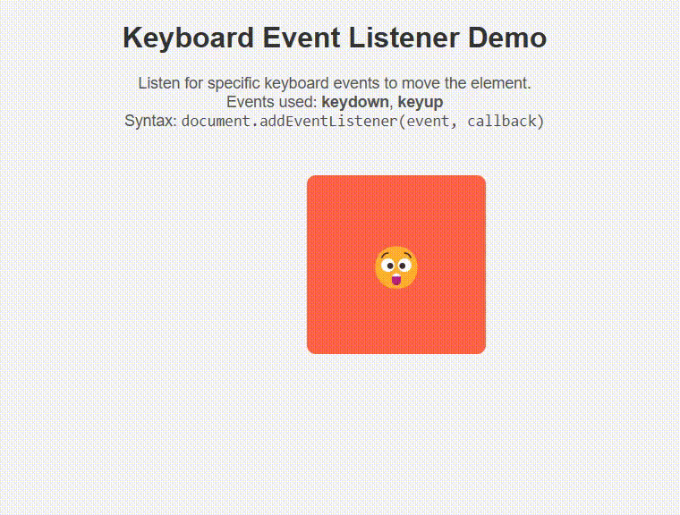

# Keyboard Event Listener Demo

This is a simple interactive web app that demonstrates the use of JavaScript keyboard event listeners (`keydown` and `keyup`) to move an element around the page.

## Features

- Moves the box using arrow keys (`↑`, `↓`, `←`, `→`)
- Emoji and color change on key press/release

## How to Run

1. Clone or download the project.
2. Open `index.html` in a browser.
3. Use arrow keys to move the box.

## Technologies Used

- HTML
- CSS
- JavaScript

## Demo GIF

You can create a demo using a screen recorder (e.g., ScreenToGif, LiceCap), then embed the image here:

