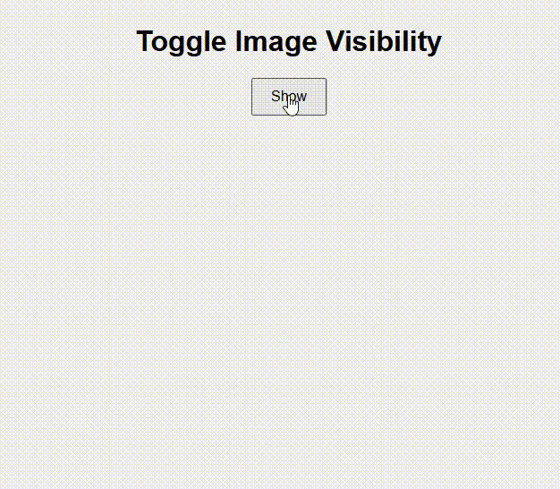

# Toggle Image Visibility

This project demonstrates how to toggle the visibility of an image using JavaScript and the `click` event.

## Features

- Toggle show/hide for an image
- Button label dynamically updates to reflect the action

## How It Works

1. Clicking the button checks the current `display` style of the image.
2. If it's hidden (`display: none`), it sets it to `block` and changes the button label to "Hide".
3. If it's visible, it hides it and updates the button label to "Show".

## Demo

## Files

- `index.html`: Main HTML structure
- `index.js`: Contains JavaScript logic
- `style.css`: Optional CSS for styling

## How to Use

1. Download all files to a directory.
2. Make sure `125584737.png` is placed in the same directory.
3. Open `index.html` in your browser.

