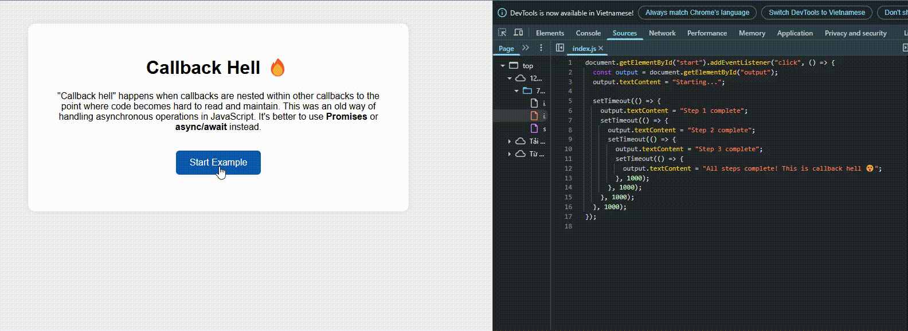

# 🔥 Callback Hell Example

This project demonstrates the concept of **Callback Hell** in JavaScript.

## ❓ What is Callback Hell?

Callback hell refers to the situation where multiple nested callbacks make the code hard to read and maintain. It typically arises when handling asynchronous operations using plain callbacks.

## ✅ How to Run

1. Open `index.html` in your browser.
2. Click the "Start Example" button.
3. Watch the output update step by step, illustrating nested callbacks.

## 📸 Demo Screenshot / GIF

> Example of the running output:

## 🚀 Better Alternatives

Instead of using nested callbacks, you should consider:

- **Promises**
- **async/await**

These modern techniques help keep your code clean and easier to follow.
