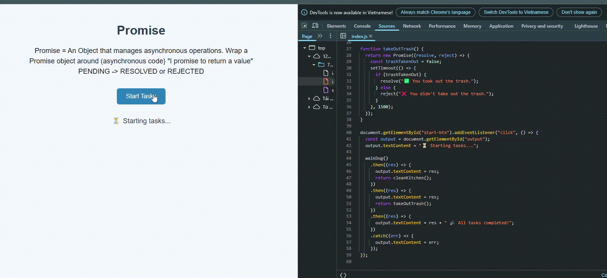

# 🐾 Promise Task Manager

A mini JavaScript project demonstrating how Promises can be used to handle asynchronous task sequences.

## 📌 Description

Each task simulates a real-world activity:
1. Walk the dog
2. Clean the kitchen
3. Take out the trash

These tasks execute in order using chained Promises, with some logic for conditional success/failure.

## 🖼️ Preview

## 🚀 How to Use

1. Open `index.html` in your browser.
2. Click **Start Tasks**.
3. Follow the output as tasks resolve or reject.

## 🧠 Topics Covered

- JavaScript Promises
- `then()` chaining
- `catch()` for error handling
- Basic DOM manipulation
- Async task simulation using `setTimeout`

---

## 📁 Files

- `index.html`: Structure and description
- `style.css`: Basic UI styling
- `index.js`: Asynchronous logic
- `preview.png`: Add screenshot/GIF of your app
