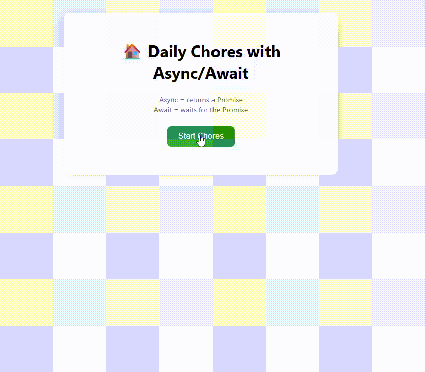

# 🧼 Async/Await Chores Simulation

This mini web project demonstrates how `async/await` and `Promise` (including `reject`) work in JavaScript with a series of daily chores.

## 📸 Preview

## 🗂️ Structure

- `index.html` – User interface
- `style.css` – Styling for layout and feedback
- `index.js` – Chore logic using async/await and promises with rejection
- `README.md` – Overview and guide

## 🔍 Features

- Simulates 3 chores: walking the dog, cleaning the kitchen, and taking out the trash
- Each returns a Promise that either `resolve`s or `reject`s after a delay
- Results are shown dynamically in the browser

## 🧪 Try It

1. Open `index.html` in your browser
2. Click "Start Chores"
3. Watch how async flow and error handling work!

## 💡 Learning Points

- `async` functions always return a `Promise`
- `await` pauses execution until the Promise is settled
- Use `try/catch` to handle both success and failure (reject)

## 🎥 Preview GIF

You can create a GIF with [ScreenToGif](./preview.gif) or take a screenshot and name it `preview.gif`.
