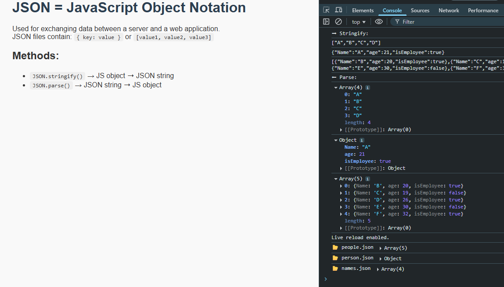

# 📦 JSON Stringify / Parse Demo

This simple JavaScript project demonstrates how to:
- Convert JavaScript objects into JSON strings using `JSON.stringify()`
- Parse JSON strings back into JavaScript objects with `JSON.parse()`
- Load `.json` files via `fetch()`

## 🌐 Preview

## 📁 Files

- `index.html` – main web page
- `style.css` – light styles
- `index.js` – JavaScript logic
- `names.json`, `person.json`, `people.json` – JSON data

## 🚀 How to Run

Just open `index.html` in a live server (VSCode extension recommended). Make sure the JSON files are in the same folder!

