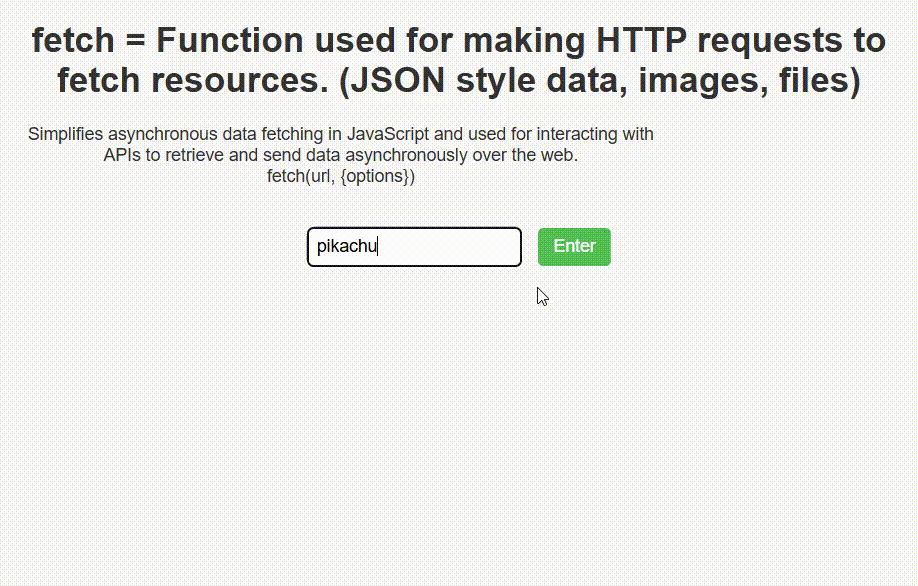

# Pokémon Fetcher 🕹️

A simple web app to fetch and display Pokémon data using the PokéAPI.

## 📸 Preview
Add your `preview.gif` below:


## ✅ Features
- Fetch Pokémon image and name
- Simple UI and clean layout
- Handles errors when Pokémon not found

## 📁 File Structure
```

project-folder/
│
├── index.html       # Main HTML (includes original explanation)
├── style.css        # CSS styles
├── index.js         # JavaScript fetch logic
└── preview\.gif      # Optional preview GIF (you add this)

```

## ⚙️ How to Run
1. Open `index.html` in your browser.
2. Type a Pokémon name (e.g., `pikachu`) and click **Enter**.

## 🌟 Examples
- pikachu
- bulbasaur
- mewtwo

## 📋 Notes
- Be sure to enter names in lowercase (e.g., `charizard`, not `Charizard`).
- The fetch API is asynchronous — JavaScript waits for response before continuing.

## 🧠 Learn More
- [PokéAPI Docs](https://pokeapi.co/)
- [MDN fetch()](https://developer.mozilla.org/en-US/docs/Web/API/Fetch_API)
